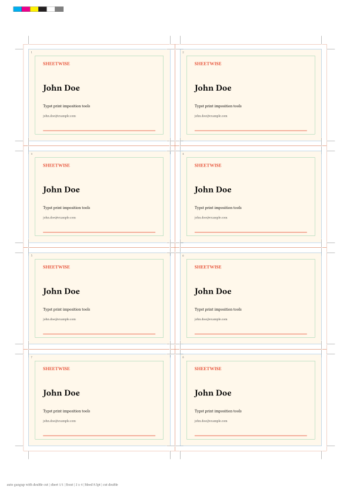
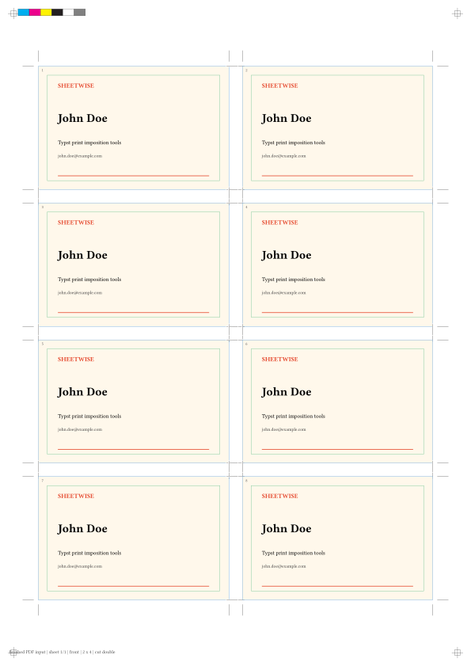
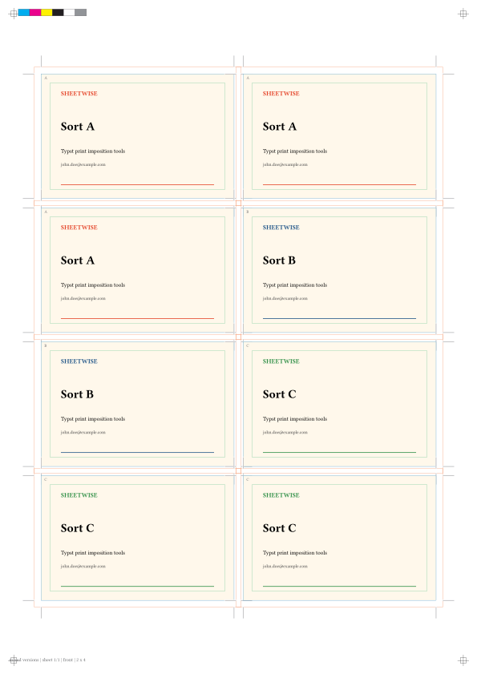
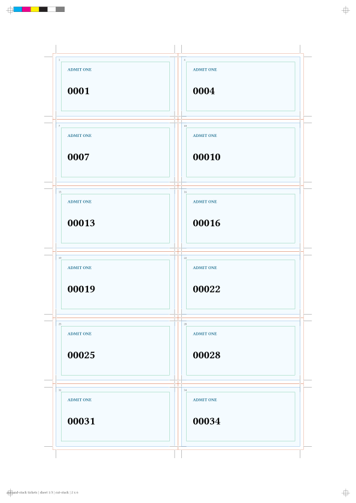
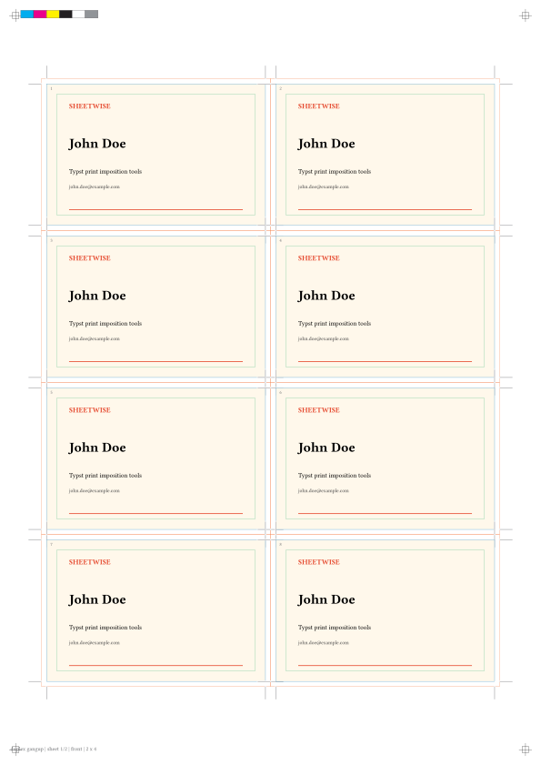
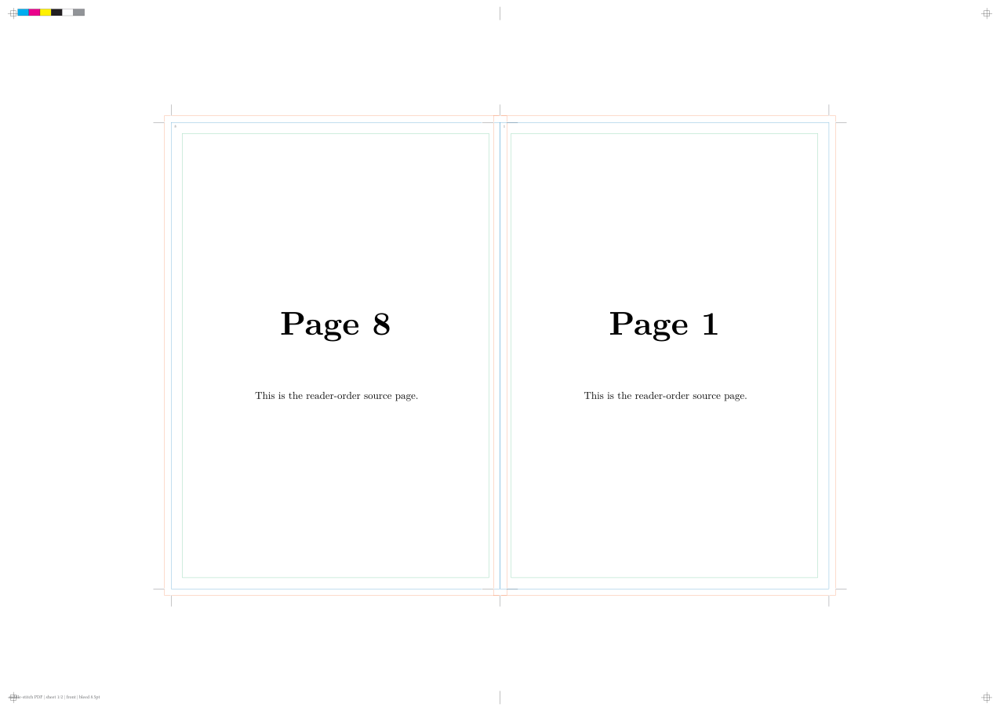
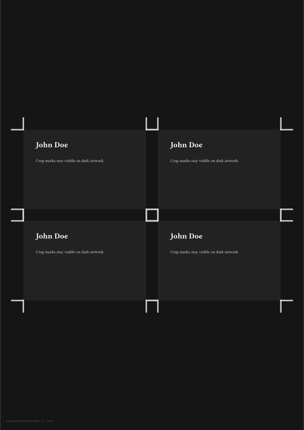
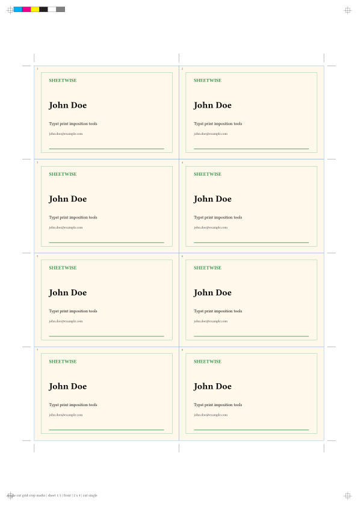

# Sheetwise

Arrange print items on press sheets in Typst.

Sheetwise is for small print-imposition jobs where you design one item and need
Typst to build the printable sheet: business cards, labels, stickers, coupons,
tickets, postcards, and small booklet proofs.

It focuses on practical print terms:

- **Nutzen / item**: the final trimmed piece.
- **Druckbogen / sheet**: the paper sheet you print on.
- **Trennschnitt / gap**: the spacing or cut strip between items.
- **Beschnitt / bleed**: artwork area outside the final trim.
- **Sicherheitsabstand / safe area**: inner guide for important content.
- **Schnittmarken / crop marks**: marks showing where to cut.
- **Schnitt im Stapel / cut-stack**: sheet order that stays sequential after
  printing, stacking, cutting, and stacking the piles again.
- **Rückstichheftung / saddle-stitch**: booklet imposition with optional
  Bundverdrängung / creep compensation.

## Use Cases

- Repeat one design across a sheet for business cards, stickers, labels,
  coupons, postcards, or small product inserts.
- Put multiple versions on one sheet, for example different names, sorts,
  colors, or languages.
- Number tickets or personalized pieces so the stack stays in order after
  printing, cutting, and restacking.
- Create front/back sheets for duplex print tests and small two-sided jobs.
- Impose reader-order PDF pages into saddle-stitch printer spreads for booklet
  proofs.
- Draw practical print guides: crop marks, bleed guides, safe-area guides,
  registration marks, fold marks, color bars, and job slugs.

## Preview

Automatic gang-up with bleed, crop marks, safe guides, and a color bar:



Finished PDF input imposed on a sheet:



Multiple sorts on one sheet:



Cut-stack numbering for tickets:



Duplex front/back sheet alignment:



Saddle-stitch PDF imposition:



White-backed crop marks on dark artwork:



Shared grid crop marks for zero-gap single cuts:



## Features

- Automatic grid planning for named paper sizes such as A4, A3, SRA3, Letter,
  and custom sheet sizes.
- Single-design gang-up, manual rows/columns, and mixed-sort sheets.
- Explicit PDF-first gang-up with `gangup-pdf`.
- Single-cut and double-cut spacing with bleed validation.
- Per-item crop marks for double cuts and shared grid crop marks for zero-gap
  single cuts.
- Cut-stack numbering with explicit stack flow.
- Duplex front/back generation with long-edge and short-edge flip handling.
- Saddle-stitch PDF imposition with blank-page padding, right/left binding,
  reading direction, fold marks, and creep compensation.
- Print guides for crop, bleed, safe area, registration, color bar, fold marks,
  and slugs.

## Input Workflows

Sheetwise can be used in two ways.

### Direct Typst Content

Use this when the print item is a small reusable Typst block inside the same
document: business cards, labels, stickers, tickets, coupons, badges, or simple
product inserts.

See `examples/02-gangup-auto.typ` for a complete direct-content example.

```typst
#import "@preview/sheetwise:0.1.0": gangup

#let card = [
  #rect(width: 100%, height: 100%, fill: rgb("#fff8eb"))[
    #pad(7mm)[
      #text(size: 15pt, weight: "bold")[John Doe]
      #v(2mm)
      john.doe\@example.com
    ]
  ]
]

#gangup(
  paper: "a4",
  item-size: (85mm, 55mm),
  bleed: 3mm,
  marks: (crop: true, bleed: true),
)[
  #card
]
```

### Finished PDF Input

Use this when the design is already a complete PDF or comes from another Typst
template with its own page setup, margins, fonts, and show rules. Compile the
design first, then impose the finished PDF.

```sh
typst compile card.typ card.pdf
```

```typst
#import "@preview/sheetwise:0.1.0": gangup-pdf

#gangup-pdf(
  "card.pdf",
  paper: "a4",
  item-size: (85mm, 55mm),
  bleed: 3mm,
  marks: (crop: true, bleed: true),
)
```

This PDF-first workflow is the safer choice for external templates, full-page
documents, invoices, flyers, booklet pages, or any design that should be treated
as already finished.

If you need lower-level control, you can still use `gangup` directly and place
the PDF yourself with `image("card.pdf", page: 1, width: 100%, height: 100%)`.

See `examples/13-pdf-input-gangup.typ` for a complete PDF-input example.

## Quick Start

```typst
#import "@preview/sheetwise:0.1.0": gangup

#gangup(
  paper: "a4",
  item-size: (85mm, 55mm),
  margin: 12mm,
  gap: 6mm,
  cut-mode: "double",
  bleed: 3mm,
  safe: 4mm,
  marks: (crop: true, bleed: true, safe: true, color-bar: true),
  slug: (job: "business cards", sheet: true, grid: true),
)[
  #rect(width: 100%, height: 100%, fill: rgb("#fff8eb"))[
    #pad(6mm)[
      #text(size: 15pt, weight: "bold")[John Doe]
      #v(2mm)
      Typst print imposition tools
    ]
  ]
]
```

Compile it:

```sh
typst compile --root . examples/02-gangup-auto.typ build/gangup-auto.pdf
```

## Workflows

### 1. One Design, Repeated Automatically

Use `gangup` when the same item should be repeated across a sheet.

```typst
#gangup(
  paper: "a4",
  item-size: (85mm, 55mm),
  gap: 6mm,
  cut-mode: "double",
  bleed: 3mm,
  marks: (crop: true, bleed: true, color-bar: true),
)[
  #my-card()
]
```

Rows and columns default to `auto`, so Sheetwise fits the maximum possible
number of items inside the selected sheet and margin.

Use `cut-mode: "single"` for a shared cut line between adjacent items. Use
`cut-mode: "double"` for a removable strip between items; when `bleed` is set,
Sheetwise requires `gap >= 2 * bleed`.

For zero-gap Trennschnitt layouts, use shared grid crop marks. The default
`crop-mode: "auto"` selects this automatically when `cut-mode: "single"` and
`gap: 0mm`, but you can set it explicitly:

```typst
#gangup(
  paper: "a4",
  item-size: (85mm, 55mm),
  rows: 4,
  columns: 2,
  gap: 0mm,
  cut-mode: "single",
  marks: (crop: true, crop-mode: "grid"),
)[
  #my-card()
]
```

Use `crop-mode: "per-item"` for ordinary double-cut layouts with a gap, where
each Nutzen keeps its own crop marks around its own trim box.

### 2. Manual Rows And Columns

Use `rows` and `columns` when the printer or finishing workflow requires a
specific grid.

```typst
#gangup(
  paper: "sra3",
  orientation: "landscape",
  item-size: (85mm, 55mm),
  item-orientation: "landscape",
  rows: 4,
  columns: 4,
  gap: (6mm, 5mm),
)[
  #my-card()
]
```

### 3. Multiple Sorts On One Sheet

Use `mixed-gangup` for multiple versions on the same sheet.

```typst
#mixed-gangup(
  paper: "a4",
  item-size: (85mm, 55mm),
  rows: 4,
  columns: 2,
  items: (
    (label: "A", copies: 3, body: card-a),
    (label: "B", copies: 2, body: card-b),
    (label: "C", copies: 3, body: card-c),
  ),
)
```

### 4. Duplex Front And Back

Use `duplex: true` with `back` content to generate a second imposed side. The
`flip` parameter controls how slots are mirrored for long-edge or short-edge
duplex printing.

```typst
#gangup(
  paper: "a4",
  item-size: (85mm, 55mm),
  rows: 4,
  columns: 2,
  duplex: true,
  back: card-back,
  flip: "long-edge",
  back-rotation: 180deg,
)[
  #card-front
]
```

Print `duplex-calibration()` first if you are unsure how your printer flips the
back side.

```typst
#duplex-calibration(paper: "a4", flip: "long-edge")
```

### 5. Cut-Stack Tickets

Use `cut-stack` for numbered or personalized items that should remain in order
after the printed stack is cut into piles.

```typst
#cut-stack(
  paper: "a4",
  item-size: (70mm, 35mm),
  rows: 6,
  columns: 2,
  count: 36,
  stack-flow: ("deep", "right", "down"),
  item: n => ticket(n),
)
```

The default `flow: "cut-stack"` places records down the stack first, then moves
through the sheet positions. Use `flow: "n-up"` when you want ordinary sheet-by-
sheet row-major filling.

Use `stack-flow` for explicit finishing order. It takes the three axes
`"deep"` (through the printed stack), `"right"` (across columns), and `"down"`
(down rows). For example, `("deep", "right", "down")` means the first cut pile
contains consecutive numbers.

### 6. Auto Item Orientation

Use `item-orientation: "auto"` when the item may be rotated to fit more Nutzen
on a sheet.

```typst
#gangup(
  paper: "a4",
  item-size: (95mm, 45mm),
  item-orientation: "auto",
  margin: 10mm,
  gap: 4mm,
)[
  #wide-label
]
```

### 7. Saddle-Stitch PDF Imposition

First create a normal reader-order PDF:

```sh
typst compile --root . examples/06-booklet-source.typ examples/build/booklet-source.pdf
```

Then impose it:

```typst
#import "@preview/sheetwise:0.1.0": saddle-stitch-pdf

#saddle-stitch-pdf(
  "examples/build/booklet-source.pdf",
  page-count: 8,
  paper: "sra3",
  orientation: "landscape",
  trim-size: (148mm, 210mm),
  bleed: 3mm,
  creep: (paper-thickness: 0.12mm),
  blank-policy: "end",
  binding: "left",
  reading-direction: "ltr",
  marks: (crop: true, registration: true, color-bar: true, fold: true),
  proof: true,
)
```

Compile the imposed PDF:

```sh
typst compile --root . examples/07-saddle-stitch-pdf.typ build/saddle-stitch.pdf
```

To inspect the printer spread order without rendering the PDF pages:

```typst
#saddle-stitch-report(12, blank-policy: "end")
```

## Examples

```sh
mkdir -p build examples/build
typst compile examples/01-single-design.typ build/01-single-design.pdf
typst compile --root . examples/02-gangup-auto.typ build/02-gangup-auto.pdf
typst compile --root . examples/03-gangup-manual-grid.typ build/03-gangup-manual-grid.pdf
typst compile --root . examples/04-mixed-sorts.typ build/04-mixed-sorts.pdf
typst compile --root . examples/05-cut-stack-tickets.typ build/05-cut-stack-tickets.pdf
typst compile --root . examples/06-booklet-source.typ examples/build/booklet-source.pdf
typst compile --root . examples/07-saddle-stitch-pdf.typ build/07-saddle-stitch-pdf.pdf
typst compile --root . examples/08-duplex-gangup.typ build/08-duplex-gangup.pdf
typst compile --root . examples/09-duplex-calibration.typ build/09-duplex-calibration.pdf
typst compile --root . examples/10-auto-orientation.typ build/10-auto-orientation.pdf
typst compile --root . examples/11-saddle-report.typ build/11-saddle-report.pdf
typst compile --root . examples/12-crop-mark-knockout.typ build/12-crop-mark-knockout.pdf
typst compile --root . examples/01-single-design.typ examples/build/business-card-source.pdf
typst compile --root . examples/13-pdf-input-gangup.typ build/13-pdf-input-gangup.pdf
typst compile --root . examples/14-single-cut-grid-crop-marks.typ build/14-single-cut-grid-crop-marks.pdf
typst compile --root . tests/smoke.typ build/smoke.pdf
```

## API Notes

Common props:

- `paper`: named paper size or custom `(width, height)`.
- `orientation`: `"portrait"` or `"landscape"` for the sheet.
- `item-size`: finished trim size of one Nutzen.
- `item-orientation`: `"original"`, `"portrait"`, `"landscape"`, or `"auto"`.
- `gap`: distance between trim boxes.
- `cut-mode`: `"single"` or `"double"`.
- `bleed`: artwork allowance outside the trim.
- `safe`: inner guide for important content.
- `marks`: boolean or dictionary with `crop`, `crop-mode`, `bleed`, `safe`,
  `registration`, `color-bar`, and `fold`.
- `mark-style`: crop-mark drawing options such as `length`, `thickness`,
  `color`, `offset`, `bleed-offset`, `no-bleed-offset`, `knockout`,
  `knockout-color`, and `knockout-padding`.
- `slug`: string or dictionary with fields such as `job`, `sheet`, `grid`,
  `bleed`, and `cut-mode`.

Crop-mark offset:

- Crop marks are drawn as a black mark over a white knockout rectangle so they
  stay readable on dark or busy artwork.
- `marks.crop-mode: "auto"` uses shared `"grid"` marks for
  `cut-mode: "single"` with `gap: 0mm`; otherwise it uses `"per-item"` marks.
- `marks.crop-mode: "per-item"` draws crop marks around every Nutzen. This is
  the right shape for Doppelschnitt / double-cut layouts with a gap.
- `marks.crop-mode: "grid"` draws one shared set of marks on the grid cut lines.
  This is the right shape for Trennschnitt / single-cut layouts with no gap.
- `offset` is the explicit distance from the trim edge to the inner end of the
  crop mark. Use it when your printer gives an exact mark offset.
- If `offset: auto`, Sheetwise uses `bleed + bleed-offset` when `bleed` is
  present. This places marks at or outside the bleed box.
- If `offset: auto` and `bleed: 0pt`, Sheetwise uses `no-bleed-offset`.

```typst
#gangup(
  paper: "a4",
  item-size: (85mm, 55mm),
  bleed: 3mm,
  marks: (crop: true),
  mark-style: (
    offset: auto,
    bleed-offset: 1mm,
    no-bleed-offset: 2mm,
    knockout: true,
  ),
)[
  #my-card()
]
```

Workflow-specific props:

- `duplex`, `back`, `flip`, `back-rotation`: generate and align a second side.
- `gangup-pdf`: impose a finished one-page PDF without writing the `image(...)`
  wrapper yourself. Use `page`, `fit`, `back-source`, and `back-page` for PDF
  page selection and duplex backs.
- `stack-flow`: explicit cut-stack axis order, for example
  `("deep", "right", "down")`.
- `blank-policy`, `binding`, `reading-direction`: booklet padding and spread
  direction.
- `creep`: booklet creep compensation as a length or dictionary such as
  `(paper-thickness: 0.12mm)`.

## Current Limits

Sheetwise is a Typst package, not a PDF preflight engine. It can arrange pages
and draw guides, but it cannot guarantee PDF/X conformance, convert color
profiles, inspect image resolution, or rewrite PDF page boxes. Those features
need compiler support or external prepress tooling.

PDF imposition uses Typst's built-in ability to place PDF pages as images. You
must provide `page-count` because Typst package code cannot currently inspect
the number of pages in an external PDF.
